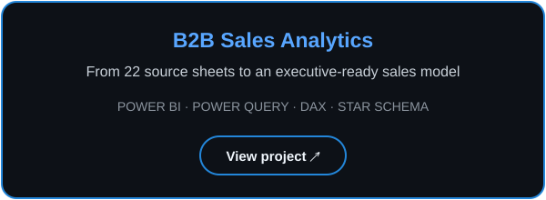
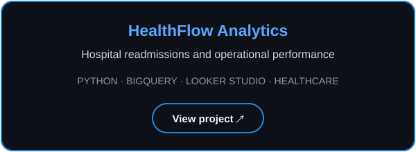
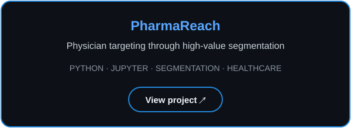
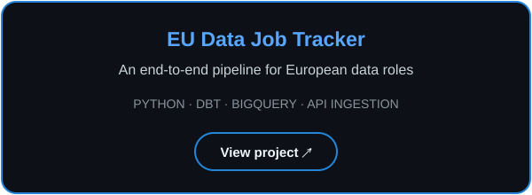

# Hi, I'm Carlos!

**Data Analyst · Power BI Analyst · Business Intelligence**

<a href="https://www.linkedin.com/in/carlosveradiago/" title="Connect with me on LinkedIn"></a>&nbsp;
<a href="https://miritai.com" title="Visit Miritai"></a>&nbsp;
<a href="./assets/CV.pdf" title="View my résumé"></a>

<br>

<sub>01 / PERSPECTIVE</sub>

## Business context meets data.

I am a data-driven operations and financial analyst with **6+ years of experience** across healthcare and financial services in Spain and Colombia. I turn fragmented operational data into reporting that supports clear leadership decisions.

Building and owning BI reporting has been central to every role—from Excel-based financial models and ERP data to SQL Server, Power BI semantic models, DAX, and executive dashboards. My background in **Communication and Business**, strengthened through an **MBA**, helps me connect the numbers to the decision behind them.

Since 2026, I run **[Miritai](https://miritai.com)**, my own data and automation practice for small businesses — scoping engagements, building reporting dashboards, and automating workflows end to end.

I am focused on strengthening my Microsoft data-platform foundation through Microsoft Fabric, and hands-on projects.

<br>

---

<br>

<sub>02 / TOOLKIT</sub>

## Tools for useful, reliable analytics.

### Production experience


End-to-end BI reporting—from raw ERP data and transformation to semantic models and dashboards used for operational and executive decision-making.

### Modern data stack


Hands-on projects in analytics engineering, cloud data platforms, pipeline development, dimensional modeling, and data quality.

<br>

---

<br>

<sub>03 / SELECTED WORK</sub>

## Four projects. One evolving practice.

<p align="center">
  <a href="https://github.com/cgveradi/b2b-sales-star-schema-powerbi"></a>
  <a href="https://github.com/cgveradi/healthflow-analytics"></a>
  <br><br>
  <a href="https://github.com/cgveradi/pharmareach"></a>
  <a href="https://github.com/cgveradi/eu-data-jobtracker"></a>
</p>

<br>

---

<br>

<sub>04 / LEARNING</sub>

## Current direction.

```text
Microsoft Data Platform
├── DP-900 & DP-600 preparation
├── Microsoft Fabric
├── Power BI semantic models
└── Azure data fundamentals

Analytics Engineering
├── dbt / databricks transformation workflows
├── dimensional modeling
└── data quality & testing

Python
├── analytics pipelines
├── automation
└── business-focused data products
```

<br>

---

<br>

<sub>05 / BACKGROUND</sub>

## A cross-sector path into data.

```text
Operations
Spain 🇪🇸
        │
        ▼
Financial Data Analysis
Colombia 🇨🇴
        │
        ▼
Healthcare Operations
Spain 🇪🇸
        │
        ▼
Data Analytics & Power BI
Microsoft Fabric path
```

This path gives me something I value deeply: **technical curiosity grounded in real operational and business experience.**

### Education

**MBA** — EAE Business School · Universitat de Barcelona<br>
**Data Analytics Bootcamp** — Ironhack<br>
**BA in Communication** — Universidad de La Sabana

### Languages

**Spanish** — Native &nbsp;·&nbsp; **English** — Fluent &nbsp;·&nbsp; **German** — Intermediate
